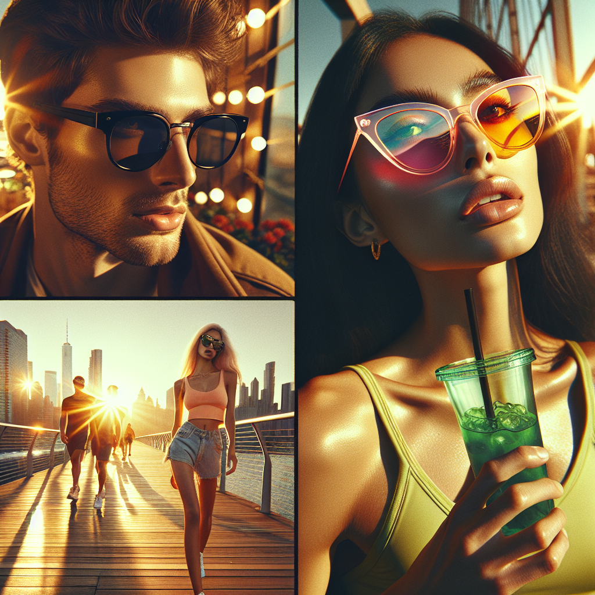

# 🕶️ Summer Sunglasses Campaign – Executive Summary

## 📊 Refined Trend Insights
Summer 2025 Campaign Executive Summary  
Date: October 15, 2025

Overview  
We recommend capitalizing on three converging eyewear trends—retro revival, futuristic performance, and subtle color accents—to drive a summer collection that resonates with distinct consumer segments and maximizes revenue potential.

Key Market Trends  
1. Oversized Retro Revival  
   – Consumers are gravitating toward thick acetate frames inspired by iconic ’70s/’80s silhouettes (Wayfarer, cat-eye).  
2. Futuristic Shield & Wraparound Styles  
   – Single-lens, wraparound designs with sporty, tech-infused details are rising in popularity among active, outdoors-focused buyers.  
3. Color-Tinted & Transparent Frames  
   – Soft hues and clear frames provide a refined, fashion-forward alternative that appeals to style-driven shoppers.

Selected Styles & Strategic Fit  
1. Wayfarer (SG002)  
   • Bold acetate construction and rectangular lenses embody the retro trend.  
   • Ultra-limited inventory (6 units) creates a premium “drop” mentality, driving urgency.  
2. Mystique Cat-Eye (SG003)  
   • Feminine, retro-inspired form with embellished temples taps into our “refined details” narrative.  
   • Positions the brand in the higher-margin women’s accessory segment.  
3. Sport Wraparound (SG004)  
   • Single curved lens and rubber grips meet the performance eyewear demand.  
   • Appeals directly to festival-goers and outdoor athletes, broadening our market reach.

Strategic Rationale  
By featuring one heritage-style, one fashion-forward, and one performance-driven model, we:  
– Engage all major summer consumer cohorts (fashion-forward trendsetters, nostalgic buyers, active lifestyles).  
– Create cross-sell and up-sell opportunities across price tiers.  
– Reinforce our brand as both style authority and technical innovator—driving incremental sales and strengthening market leadership this summer.

## 🎯 Campaign Visual

    

## ✍️ Campaign Quote
Golden Hour Glam: Retro Revival Meets Futuristic Edge

## ✅ Why This Works
This line captures the image’s sun-drenched, golden-hour mood while nodding to bold ’70s/’80s silhouettes and color-tinted cat-eyes alongside sleek, tech-inspired wraparound styles—perfectly aligning with the summer retro-meets-futuristic eyewear trend.

---

*Report generated on 2025-10-15*
